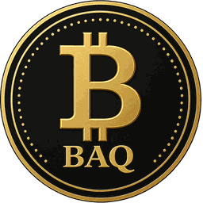

# BotRadix BAQ — Official Token Metadata

This repository is the **canonical public metadata source for BAQ**, the official utility and access token of the **BotRadix ecosystem on Base**. It is maintained so wallets, decentralized exchanges, explorers, indexers, market-data services and other integrations can resolve BAQ from one consistent source.

## Official BAQ identity

| Field | Value |
| --- | --- |
| Project | **BotRadix** |
| Token | **BAQ** |
| Symbol | **BAQ** |
| Network | **Base** |
| Chain ID | **8453** |
| Standard | **ERC-20** |
| Contract | `0x1B9f61483Dd6710E1Ad3b9d0bb92b710F1BA56B5` |
| Decimals | **18** |
| Maximum supply | **5,000,000,000 BAQ** |
| Canonical market | **BAQ / USDC** |

## What is BAQ?

**BAQ is the on-chain utility and access layer of BotRadix.** It gives the BotRadix ecosystem a verifiable blockchain asset on Base that can connect supported platform functionality with a user's confirmed on-chain BAQ holdings.

BAQ is designed for ecosystem utility, access and integration. Compatible BotRadix products can use verified BAQ balances as part of access-tier logic and product capabilities, while the public token identity provides a single contract-based reference for external wallets, DEX interfaces, explorers, indexers and market-data systems.

### Ecosystem utility

- **Access:** verified BAQ holdings can be used by compatible BotRadix tiers and product capabilities.
- **Automation ecosystem:** BAQ is integrated with the broader BotRadix automation product environment.
- **On-chain identity:** Base chain ID `8453` plus the contract address is the canonical identity of BAQ.
- **Market discovery:** official metadata identifies the BAQ/USDC market context for external integrations.
- **Interoperability:** standardized public metadata is maintained for DEXs, wallets, explorers, indexers and token directories.

## Canonical integration endpoints

- **Token List:** https://soportebotradix.github.io/botradix-baq-tokenlist/botradix-tokenlist-final.json
- **Raw Token List:** https://raw.githubusercontent.com/soportebotradix/botradix-baq-tokenlist/main/botradix-tokenlist-final.json
- **Extended Metadata:** https://soportebotradix.github.io/botradix-baq-tokenlist/baq-token-metadata.json
- **Transparent 256×256 Logo:** https://raw.githubusercontent.com/soportebotradix/botradix-baq-tokenlist/main/BAQ-logo-256.png
- **Official BAQ Page:** https://www.botradix.com/baq
- **BaseScan:** https://basescan.org/token/0x1B9f61483Dd6710E1Ad3b9d0bb92b710F1BA56B5
- **Uniswap on Base:** https://app.uniswap.org/swap?chain=base&outputCurrency=0x1B9f61483Dd6710E1Ad3b9d0bb92b710F1BA56B5

## For DEXs, wallets and indexers

BAQ should always be identified by:

- `chainId`: `8453`
- `address`: `0x1B9f61483Dd6710E1Ad3b9d0bb92b710F1BA56B5`
- `symbol`: `BAQ`
- `decimals`: `18`

The canonical token list follows the **Uniswap Token Lists** structure. Rich project information that does not belong in the strict token-list schema is published separately in `baq-token-metadata.json`.

## Tokenomics reference

The published maximum supply is **5,000,000,000 BAQ**. This repository intentionally distinguishes maximum supply from live circulating or current total supply; live supply values should be read from authoritative on-chain or indexed sources when needed.

## Branding

`BAQ-logo-256.png` is the current official BAQ token mark supplied as a **transparent PNG**. Transparent padding allows wallets, DEXs and explorers to render the mark cleanly on both light and dark interfaces.

## Repository files

- `botradix-tokenlist-final.json` — canonical DEX/wallet token list.
- `baq-token-metadata.json` — extended machine-readable BAQ metadata.
- `BAQ-logo-256.png` — official transparent BAQ token logo.
- `README.md` — human-readable integration reference.

---

**BotRadix · BAQ · Base**  
Official public token identity and integration metadata.
